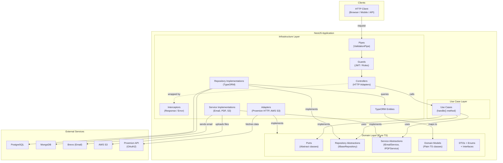
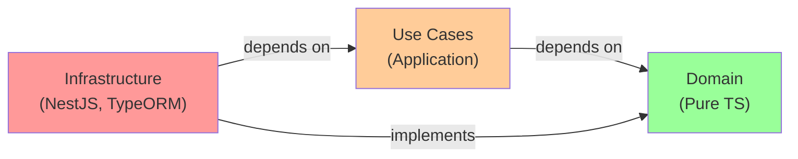
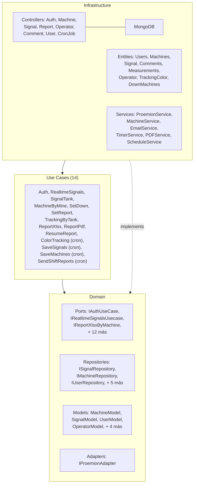
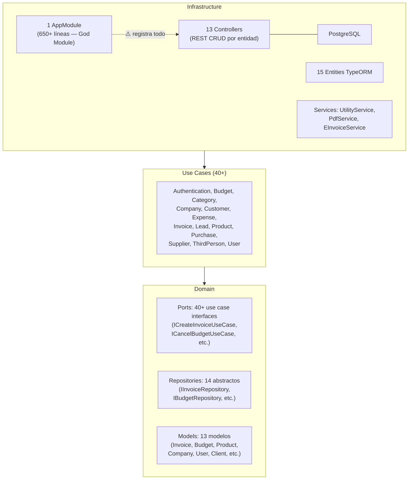
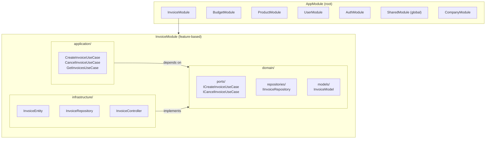

# Architecture Guide — Workspace Vendex

> Guía arquitectónica basada en el análisis del código fuente real de los tres repositorios.
> Toda afirmación está respaldada por evidencia encontrada en el workspace.

---

## ARQUITECTURA ACTUAL

### Resumen

Los tres repositorios implementan **Arquitectura Hexagonal (Ports & Adapters)** con una estructura de tres capas consistente. La adopción es genuina: el dominio de negocio está correctamente aislado de los frameworks.

### Capas encontradas

```
domain/         ← Núcleo de negocio. Sin dependencias de NestJS/TypeORM.
usecases/ (o usecase/)  ← Orquestación de casos de uso.
infrastructure/ ← Adaptadores: NestJS, TypeORM, SDKs externos.
```

### Stack tecnológico común

| Componente    | Tecnología                                       | Versiones                                 |
| ------------- | ------------------------------------------------ | ----------------------------------------- |
| Framework     | NestJS                                           | v8 (asapi), v9 (versatil), v10 (tracking) |
| ORM           | TypeORM                                          | 0.3.x                                     |
| Base de datos | PostgreSQL (asapi, versatil), MongoDB (tracking) |
| Autenticación | Passport JWT + Local                             | passport-jwt 4.x                          |
| Validación    | class-validator + class-transformer              | 0.14.x                                    |
| Email         | @getbrevo/brevo                                  | 1.x                                       |
| PDF           | Puppeteer + Handlebars                           | puppeteer 19-22.x                         |
| Storage       | AWS S3                                           | @aws-sdk v2/v3                            |
| Documentación | @nestjs/swagger                                  | 5-7.x                                     |
| Testing       | Jest + ts-jest                                   | 29.x                                      |

---

## DIAGRAMA DE ARQUITECTURA ACTUAL



---

## FLUJO DE DEPENDENCIAS



**La flecha de dependencia siempre apunta hacia el dominio.** El dominio no sabe nada de la infraestructura.

---

## DIAGRAMA POR REPOSITORIO

### tracking-trucks-api



### asapi (ERP Contabilidad)



---

## ARQUITECTURA OBJETIVO

La arquitectura objetivo mantiene la esencia hexagonal pero la organiza en **módulos feature-based** para resolver el problema del god module y mejorar la cohesión.



### Diferencias clave actual vs objetivo

| Aspecto                | Estado actual                    | Objetivo                                     |
| ---------------------- | -------------------------------- | -------------------------------------------- |
| Módulos NestJS         | 1 god module (asapi)             | Feature modules por dominio                  |
| Estructura de carpetas | Plana por capa                   | Por feature dentro de cada capa              |
| DI wiring              | Centralizado en AppModule        | Distribuido en feature modules               |
| TypeScript             | `strict: false`                  | `strict: true` por módulo nuevo              |
| Logging                | `console.log`                    | `Logger` estructurado de NestJS              |
| Testing                | Solo smoke tests                 | Unit + Integration + E2E                     |
| CORS                   | `origin: '*'`                    | Lista blanca por env                         |
| Guards                 | Declarados, no siempre aplicados | Aplicados por defecto, `@Public()` explícito |

---

## REGLAS ARQUITECTÓNICAS

### Reglas de oro (nunca violar)

1. **`domain/` es framework-agnostic.** No importa NestJS, TypeORM, Axios ni ningún SDK externo.

2. **Controllers solo hablan con use cases.** Nunca con repositorios, servicios de infraestructura, ni TypeORM directamente.

3. **Use cases dependen de ports (abstracciones), no de implementaciones.** El módulo NestJS es el único lugar donde se conecta la abstracción con la implementación.

4. **Un repositorio por agregado.** No mezclar entidades de diferentes aggregates en el mismo repositorio.

5. **Cada use case tiene una sola responsabilidad.** `CreateInvoiceUseCase` no debe también enviar email ni actualizar stock directamente — puede hacerlo vía eventos o delegando en otros use cases.

### Restricciones de imports (aplicar con ESLint)

```typescript
// .eslintrc.js — reglas de dependencia entre capas
rules: {
  'no-restricted-imports': ['error', {
    patterns: [
      // domain NO puede importar infrastructure
      { group: ['**/infrastructure/**'], message: 'Domain cannot import from Infrastructure' },
      // domain NO puede importar NestJS (excepto decoradores de DI)
      { group: ['@nestjs/typeorm', 'typeorm'], message: 'Domain cannot use TypeORM' },
    ]
  }]
}
```

### Patrones obligatorios

```
✅ Ports como abstract classes (no interfaces puras)
✅ Repository pattern con IBaseRepository<T> genérico
✅ Use case method: handle()
✅ DTOs en domain/dtos/ con class-validator
✅ Barrel files index.ts en cada carpeta de domain
✅ kebab-case para nombres de archivos
✅ ValidationPipe global en bootstrap
✅ Logger de NestJS (no console.log)
✅ JWT guard por defecto en todos los endpoints
✅ Swagger @ApiTags en todos los controllers
```

### Patrones prohibidos

```
❌ TypeORM Entities como modelos de dominio
❌ Repositorios TypeORM inyectados directamente en use cases
❌ Lógica de negocio en controllers
❌ console.log en código de producción
❌ CORS origin: '*' en producción
❌ Credenciales hardcodeadas (incluyendo docker-compose)
❌ any como tipo en métodos públicos
❌ God modules con 20+ providers
❌ Imports circulares entre módulos
```

---

## FLUJO DE DATOS DETALLADO

### Request exitosa (ejemplo: crear factura)

```
1. HTTP POST /api/invoice
   → ValidationPipe (whitelist, transform)
   → AuthGuard('jwt') → JwtStrategy.validate() → UserModel en req.user
   → InvoiceController.create(@Body() dto: CreateInvoiceDTO)

2. Controller → UseCase
   → this.createInvoice.handle(dto)

3. UseCase → Domain
   → this.clientRepo.findOne({ where: { id: dto.clientId } })
     → ClientRepository (TypeORM) → SELECT FROM clients WHERE id = ?
     → PostgreSQL → Row data
     → Repository maps Entity → ClientModel
   → If not found → throw NotFoundException
   → this.invoiceRepo.save({ ...dto, isActive: true })
     → InvoiceRepository (TypeORM) → INSERT INTO invoices
     → PostgreSQL → New row
     → Repository maps Entity → InvoiceModel

4. UseCase → Response
   → return InvoiceModel

5. ResponseInterceptor wraps: { status: true, data: InvoiceModel }
6. HTTP 201 Created { status: true, data: { id: '...', ... } }
```

### Error de validación

```
1. HTTP POST /api/invoice con body inválido
   → ValidationPipe detecta violación de @IsUUID() en clientId
   → throw BadRequestException({ message: ['clientId must be a UUID'] })
   → ErrorsInterceptor catches → formatea respuesta
   → HTTP 400 { status: false, message: 'Bad Request', reason: ['clientId must be a UUID'] }
```

---

## OBSERVACIONES POR REPOSITORIO

### tracking-trucks-api ⭐⭐⭐⭐ (Más maduro)

- Hexagonal bien implementado con adapters OAuth2 (Proemion)
- Cron jobs correctamente abstraídos detrás de ports
- Uso de MongoDB Aggregation Pipelines encapsulado en el repositorio
- **Mejora pendiente:** Testing, CORS, Logger

### asapi ⭐⭐⭐ (Más completo en dominio)

- El dominio más rico: 13 bounded contexts, 40+ ports
- Interceptors globales implementados correctamente
- Middleware de logging HTTP presente
- **Problema crítico:** God module de 650 líneas
- **Mejora pendiente:** Feature modules, testing, strict TS

### versatil-api ⭐⭐⭐ (Más simple, con gaps)

- Arquitectura correcta pero endpoints sin auth activa
- Typo en filename (`upload.controlle.ts`)
- **Problema crítico:** Todos los endpoints son públicos
- **Mejora pendiente:** Activar guards, testing

---

_Guía generada a partir del análisis del workspace Vendex — Junio 2026._
