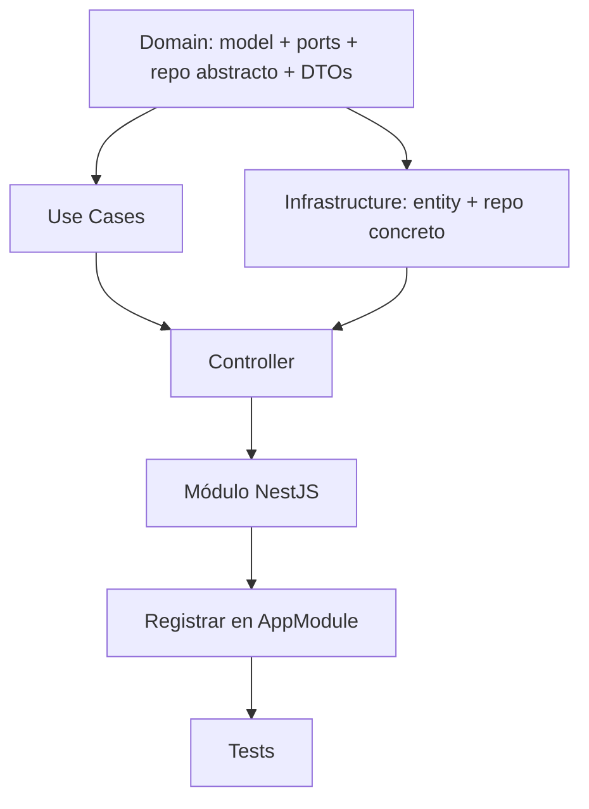

# SPEC: [Nombre del módulo o funcionalidad]

> **Tipo:** `feature` | `bugfix` | `refactor` | `ai-integration`
> **Prioridad:** `crítica` | `alta` | `media` | `baja`
> **Estado:** `borrador` | `en revisión` | `aprobada` | `en desarrollo` | `completada`
> **Autor:** @username
> **Fecha:** YYYY-MM-DD

---

## 1. CONTEXTO

<!--
  ¿Por qué existe esta spec? ¿Qué problema de negocio resuelve?
  Máximo 3 párrafos. No describir la solución aquí, solo el problema.
-->

**Problema:**
[Describe el problema que motiva este cambio. Ej: "Los clientes no pueden exportar reportes
en formato PDF, lo que les obliga a hacer capturas de pantalla manuales."]

**Impacto actual sin la funcionalidad:**
[Ej: "Se estiman 2 horas semanales de trabajo manual por empresa. Con 50 clientes activos
eso son 100 horas semanales de ineficiencia."]

**Decisión de construir:**
[¿Por qué construirlo ahora? ¿Qué lo desbloquea?]

---

## 2. ALCANCE

### Incluido ✅

- [Qué sí se implementa en esta iteración]
- [Ser específico: "Crear endpoint POST /api/reports/pdf", NO "hacer reportes"]

### Excluido ❌

- [Qué explícitamente NO entra en esta iteración]
- [Ej: "Reportes en formato Excel — queda para una spec futura"]

---

## 3. ARQUITECTURA HEXAGONAL

> Este proyecto usa **Arquitectura Hexagonal (Ports & Adapters)**. Todo cambio debe respetar
> las tres capas: `domain/` → `usecases/` → `infrastructure/`.

### 3.1 Capa de Dominio (`src/domain/`)

**Modelos nuevos o modificados:**

```
src/domain/models/
└── [nombre].model.ts          ← Plain TypeScript, sin decoradores NestJS/TypeORM
```

```typescript
// Ejemplo: src/domain/models/report.model.ts
export class ReportModel {
  id: string;
  // ... campos del dominio
  createdAt: Date;
}
```

**Ports (casos de uso abstractos):**

```
src/domain/ports/
├── create-[nombre].usecase.ts
├── get-[nombre].usecase.ts
└── index.ts
```

```typescript
// Ejemplo abstracto
export abstract class ICreateReportUseCase {
  abstract handle(dto: CreateReportDTO): Promise<ReportModel>;
}
```

**Repositorios abstractos:**

```
src/domain/repositories/
└── [nombre].repository.ts     ← Extiende IBaseRepository<Model>
```

**DTOs:**

```
src/domain/dtos/[nombre]/
├── create-[nombre].dto.ts
├── update-[nombre].dto.ts
└── index.ts
```

**Enums / Interfaces nuevas:**

```
src/domain/enums/[nombre].enum.ts
src/domain/interfaces/[nombre].interface.ts
```

---

### 3.2 Capa de Casos de Uso (`src/usecases/`)

```
src/usecases/[nombre]/
├── create-[nombre].usecase.ts
├── get-[nombre].usecase.ts
├── get-[nombre]s.usecase.ts
└── index.ts
```

**Reglas de los use cases:**
- Método único: `handle(input): Promise<output>`
- Solo orquesta: llama repositorios y servicios, no implementa lógica compleja
- Inyecta abstracciones (ports), nunca implementaciones concretas

```typescript
// Plantilla de use case
@Injectable()
export class Create[Nombre]UseCase implements ICreate[Nombre]UseCase {
  private readonly logger = new Logger(Create[Nombre]UseCase.name);

  constructor(
    private readonly [nombre]Repo: I[Nombre]Repository,
    // Agregar más dependencias abstractas según necesidad
  ) {}

  async handle(dto: Create[Nombre]DTO): Promise<[Nombre]Model> {
    this.logger.log(`[handle] Creating [nombre] — [campo clave]: ${dto.[campo]}`);
    // orquestación...
  }
}
```

---

### 3.3 Capa de Infraestructura (`src/infrastructure/`)

**Entidades TypeORM:**

```
src/infrastructure/entities/
└── [nombre].entity.ts         ← Decoradores @Entity, @Column, etc.
```

**Repositorios concretos:**

```
src/infrastructure/repositories/
└── [nombre].repository.ts     ← Extiende BaseRepository<Entity>, implements I[Nombre]Repository
```

**Controladores:**

```
src/infrastructure/controllers/
└── [nombre].controller.ts
```

```typescript
// Plantilla de controller
@ApiBearerAuth()
@ApiTags('[NOMBRE_MAYUS]')
@UseGuards(AuthGuard('jwt'))
@Controller('[nombre]')
export class [Nombre]Controller {
  constructor(
    private readonly create[Nombre]: ICreate[Nombre]UseCase,
    private readonly get[Nombre]: IGet[Nombre]UseCase,
    private readonly get[Nombre]s: IGet[Nombre]sUseCase,
  ) {}

  @Post()
  @HttpCode(HttpStatus.CREATED)
  async create(@Body() body: Create[Nombre]DTO): Promise<[Nombre]Model> {
    return this.create[Nombre].handle(body);
  }

  @Get(':id')
  async findOne(@Param() { id }: ParamUuidDTO): Promise<[Nombre]Model> {
    return this.get[Nombre].handle(id);
  }
}
```

**Módulo NestJS:**

```
src/infrastructure/modules/
└── [nombre].module.ts
```

```typescript
@Module({
  imports: [TypeOrmModule.forFeature([[Nombre]Entity])],
  controllers: [[Nombre]Controller],
  providers: [
    { provide: ICreate[Nombre]UseCase, useClass: Create[Nombre]UseCase },
    { provide: IGet[Nombre]UseCase, useClass: Get[Nombre]UseCase },
    { provide: I[Nombre]Repository, useClass: [Nombre]Repository },
  ],
  exports: [I[Nombre]Repository],
})
export class [Nombre]Module {}
```

---

## 4. ENDPOINTS HTTP

> Documentar todos los endpoints que expone esta funcionalidad.

| Método | Path | Auth | Roles | Descripción |
|--------|------|------|-------|-------------|
| `POST` | `/api/[nombre]` | JWT | USER, ADMIN | Crear [nombre] |
| `GET` | `/api/[nombre]` | JWT | USER, ADMIN | Listar con paginación |
| `GET` | `/api/[nombre]/:id` | JWT | USER, ADMIN | Obtener por ID |
| `PATCH` | `/api/[nombre]/:id` | JWT | ADMIN | Actualizar parcial |
| `DELETE` | `/api/[nombre]/:id` | JWT | ADMIN | Eliminar |

### Request / Response de ejemplo

**POST `/api/[nombre]`**

```json
// Request body
{
  "campo1": "valor",
  "campo2": 123
}

// Response 201 — envuelto por ResponseInterceptor
{
  "status": true,
  "data": {
    "id": "550e8400-e29b-41d4-a716-446655440000",
    "campo1": "valor",
    "campo2": 123,
    "createdAt": "2026-06-02T10:00:00.000Z"
  }
}
```

---

## 5. VARIABLES DE ENTORNO NUEVAS

> Si esta funcionalidad requiere nuevas variables de entorno, listarlas aquí.
> Recordar actualizar `.env.example` y `src/config/validation-schema.ts`.

```env
# [Nombre del módulo]
NUEVA_VAR=valor_default          # Descripción clara de para qué sirve
OTRA_VAR=                        # Requerida, sin default
```

---

## 6. INTEGRACIÓN DE IA (si aplica)

> Completar esta sección solo si la funcionalidad involucra llamadas a LLMs o embeddings.

### 6.1 Caso de uso de IA

**¿Qué tarea resuelve la IA?**
[Ej: "Clasificar automáticamente el tipo de gasto a partir de la descripción de texto libre del usuario."]

**¿Por qué IA y no lógica determinista?**
[Ej: "Las categorías son abiertas y la descripción es lenguaje natural no estructurado."]

### 6.2 Diseño del prompt

```typescript
// ✅ Prompt con: rol, contexto, formato de salida, ejemplos (few-shot si es necesario)
const prompt = `
Eres un asistente especializado en [dominio].
Tu tarea es [acción concreta].

Contexto:
${JSON.stringify(contextData, null, 2)}

[Ejemplos few-shot si aplica:]
Ejemplo 1: "[input]" → "[output esperado]"
Ejemplo 2: "[input]" → "[output esperado]"

Ahora procesa:
"${sanitizedUserInput}"

Responde ÚNICAMENTE con [formato esperado: JSON/texto/número].
[Si es JSON, incluir el schema exacto aquí]
`;
```

### 6.3 Validación de output

```typescript
// Siempre validar el output antes de usarlo
const rawOutput = await this.aiAdapter.complete(prompt, { temperature: 0.1 });

// Opción A: validar contra schema Zod/Joi
// Opción B: validar contra lista de valores permitidos
// Opción C: extraer datos con regex y fallback seguro
```

### 6.4 Consideraciones de seguridad

- [ ] Input del usuario sanitizado antes de incluirlo en el prompt
- [ ] Output de la IA validado antes de persistir o retornar
- [ ] No exponer prompts de sistema al cliente
- [ ] Rate limiting aplicado en el endpoint que llama a IA
- [ ] Logging de tokens consumidos para control de costos

---

## 7. BASE DE DATOS

### Migración requerida

```sql
-- Tabla nueva o cambios en tablas existentes
-- Nombre del archivo: YYYY-MM-DD-descripcion.sql

CREATE TABLE [nombre]s (
  id UUID PRIMARY KEY DEFAULT gen_random_uuid(),
  -- campos...
  is_active BOOLEAN NOT NULL DEFAULT TRUE,
  created_at TIMESTAMPTZ NOT NULL DEFAULT NOW(),
  updated_at TIMESTAMPTZ NOT NULL DEFAULT NOW()
);
```

### Índices

```sql
CREATE INDEX idx_[nombre]s_[campo] ON [nombre]s ([campo]);
```

---

## 8. TESTING

> Siguiendo la pirámide de testing: 70% unit, 20% integration, 10% e2e.

### 8.1 Unit tests (use cases)

**Archivo:** `src/usecases/[nombre]/create-[nombre].usecase.spec.ts`

```typescript
describe('Create[Nombre]UseCase', () => {
  it('should create [nombre] successfully', async () => { ... });
  it('should throw NotFoundException when [entidad relacionada] does not exist', async () => { ... });
  it('should throw ConflictException when [condición de negocio]', async () => { ... });
});
```

**Cobertura mínima requerida:** 80% en use cases, 70% en domain services.

### 8.2 Casos de prueba críticos

| # | Escenario | Tipo | Resultado esperado |
|---|-----------|------|--------------------|
| 1 | Crear [nombre] con datos válidos | Happy path | 201 Created |
| 2 | Crear [nombre] con campo requerido faltante | Validación | 400 Bad Request |
| 3 | Acceder a [nombre] de otro usuario | Autorización | 403 Forbidden |
| 4 | Buscar [nombre] inexistente | Not found | 404 Not Found |
| 5 | [Condición de borde específica del dominio] | Edge case | [resultado] |

---

## 9. SEGURIDAD (OWASP)

- [ ] **A01 - Broken Access Control:** Verificar que usuarios solo acceden a sus propios recursos
- [ ] **A02 - Cryptographic Failures:** Datos sensibles no se loggean ni se exponen en responses
- [ ] **A03 - Injection:** DTOs usan `class-validator` con `whitelist: true`
- [ ] **A05 - Security Misconfiguration:** Nuevas env vars documentadas en `.env.example` y validadas con Joi
- [ ] **A07 - Authentication Failures:** Todos los endpoints protegidos con JWT salvo los marcados `@Public()`

---

## 10. CHECKLIST DE IMPLEMENTACIÓN

### Domain layer
- [ ] Modelo de dominio creado (Plain TypeScript, sin decoradores de infraestructura)
- [ ] Port(s) abstracto(s) definido(s) como `abstract class`
- [ ] Repositorio abstracto definido (extiende `IBaseRepository<T>`)
- [ ] DTOs con decoradores `class-validator`
- [ ] Barrel files (`index.ts`) actualizados

### Use case layer
- [ ] Un archivo por caso de uso (`create`, `get`, `update`, `delete`, `list`)
- [ ] Cada use case implementa su port abstracto
- [ ] Método único `handle()` con tipos de entrada/salida explícitos
- [ ] Logger de NestJS (nunca `console.log`)
- [ ] Errores tipados (`NotFoundException`, `ConflictException`, etc.)

### Infrastructure layer
- [ ] Entidad TypeORM creada con decoradores
- [ ] Repositorio concreto extiende `BaseRepository<Entity>` e implementa el abstracto
- [ ] Controller con decoradores `@ApiTags`, `@ApiBearerAuth`, `@UseGuards`
- [ ] Módulo NestJS registra providers con patrón `{ provide: IPort, useClass: Impl }`
- [ ] Módulo importado en `AppModule`

### Configuración
- [ ] Nuevas env vars en `.env.example`
- [ ] Nuevas env vars en `src/config/validation-schema.ts`
- [ ] Nuevas env vars en `src/config/config.ts`

### Calidad
- [ ] `npm run build` sin errores TypeScript
- [ ] `npm run lint` sin errores ESLint
- [ ] `npm run test` — cobertura ≥ 80% en use cases nuevos
- [ ] Swagger docs accesibles en `/api/docs`

---

## 11. ARCHIVOS A CREAR / MODIFICAR

> Lista completa para que el agente de IA pueda ejecutar la spec sin ambigüedad.

**Crear:**
```
src/domain/models/[nombre].model.ts
src/domain/ports/create-[nombre].usecase.ts
src/domain/ports/get-[nombre].usecase.ts
src/domain/ports/get-[nombre]s.usecase.ts
src/domain/ports/index.ts
src/domain/repositories/[nombre].repository.ts
src/domain/dtos/[nombre]/create-[nombre].dto.ts
src/domain/dtos/[nombre]/update-[nombre].dto.ts
src/domain/dtos/[nombre]/index.ts
src/usecases/[nombre]/create-[nombre].usecase.ts
src/usecases/[nombre]/get-[nombre].usecase.ts
src/usecases/[nombre]/get-[nombre]s.usecase.ts
src/usecases/[nombre]/index.ts
src/infrastructure/entities/[nombre].entity.ts
src/infrastructure/repositories/[nombre].repository.ts
src/infrastructure/controllers/[nombre].controller.ts
src/infrastructure/modules/[nombre].module.ts
```

**Modificar:**
```
src/app.module.ts                     ← Importar [Nombre]Module
src/domain/index.ts                   ← Exportar nuevos ports/models/repos
.env.example                          ← Nuevas variables (si aplica)
src/config/config.ts                  ← Nuevas variables (si aplica)
src/config/validation-schema.ts       ← Validar nuevas variables (si aplica)
```

---

## 12. DEPENDENCIAS Y ORDEN DE IMPLEMENTACIÓN



**Regla:** Implementar siempre domain primero. Nunca importar infraestructura desde domain.

---

## 13. PREGUNTAS ABIERTAS

> Decisiones que aún no están resueltas al momento de escribir la spec.

| # | Pregunta | Responsable | Fecha límite | Decisión |
|---|----------|-------------|--------------|----------|
| 1 | [Pregunta técnica o de negocio sin respuesta] | @username | YYYY-MM-DD | Pendiente |

---

## 14. REFERENCIAS

- Arquitectura hexagonal del proyecto: `~/.github/architecture/architecture-guide.md`
- Convenciones de código: `~/.github/instructions/project.instructions.md`
- Skill NestJS: `~/.github/skills/nestjs/SKILL.md`
- Skill Hexagonal: `~/.github/skills/hexagonal/SKILL.md`
- Skill Testing: `~/.github/skills/testing/SKILL.md`
- Skill AI Engineering: `~/.github/skills/ai-engineering/SKILL.md`
